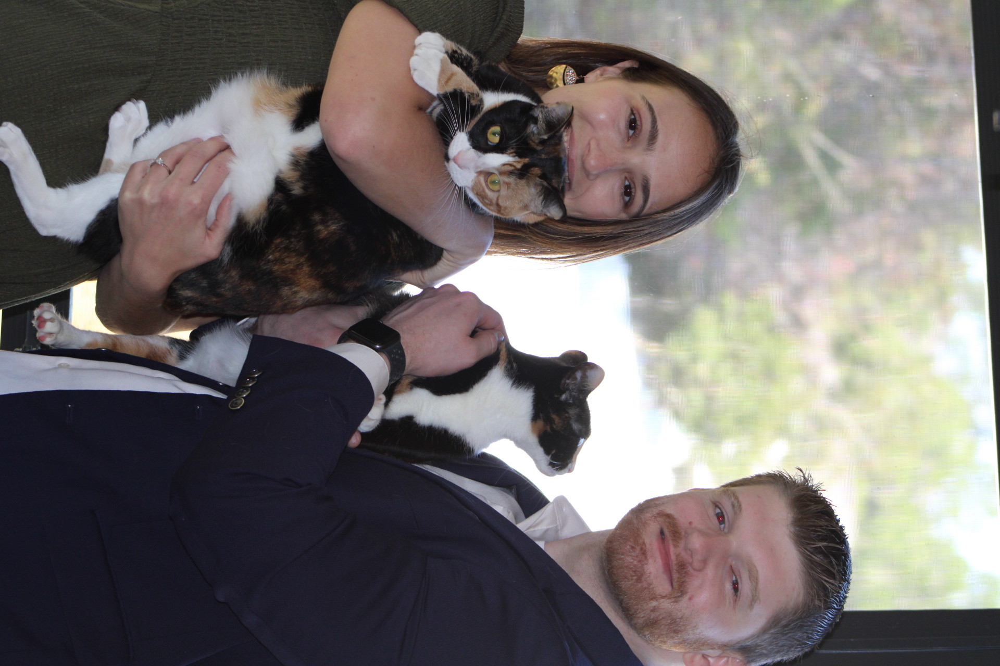

# Welcome to My Portfolio

### About Me

Hi! I am a northerner born and raised, currently navigating living in the south. I love the outdoors and recently have found a passion for running. My fiance and I have two Calico cats named Georgia and Luna, and I love to cook and code! Follow for more of the latter.

### Learn About My Projects
---

#### [Heart Disease Analysis](https://www.linkedin.com/pulse/occurrence-heart-disease-us-rachael-finch-8imwe/)

A Python analysis of the health status of over 400,000 individuals in the U.S. from 2020 and 2022. I utilized various Python libraries to create data vizualizations and correlation matrices related to heart disease. 

---
#### [Emergency Department Dashboard](https://www.linkedin.com/pulse/emergency-room-visits-dashboard-rachael-finch-v84qe/)

A Tableau dashboard created using data from ER admissions. The visualizations provide valuable insights to healthcare administrators and frontline staff as well as patients seeking care.

---
#### [Sports Analysis](/NBA_2022-2023_Season.md)

A visual exploration into the 2022-2023 NBA season player stats using Tableau. In this project, I created a story to show how the NBA is transitioning to a position-less game by focusing on key stats such as assits, rebounds, and points. 

---

#### [Healthcare Analysis](https://www.linkedin.com/pulse/increasing-patient-outcomes-using-sql-rachael-finch-velvc/?trackingId=jXem1tIxTPOApUjIvuuKJw%3D%3D)

An in-depth exploration of an extensive dataset comprising more than 70,000 individuals admitted to hospitals across the United States. My primary focus centered on analyzing the length of stay (KPI) and the utilization of lab procedures and medications among these patients. By leveraging SQL, I unearthed valuable insights crucial for stakeholders and offered strategic directions for the future based on the analysis.

---
#### [Financial Analysis](/SQL_Bank_Project.md)

A case study exploring data from The World Bank, using SQL queries. I investigated loans and grants from the IDA to various countries. Specifics such as Project Name, Service Charge Rate, Sum of Original Principal Amount, and Sum Owed to IDA were analyzed. 

---
#### [Marketing Analysis](https://www.linkedin.com/pulse/analyzing-ifood-sales-excel-rachael-finch-lcioe/?trackingId=msuWMUpeTXGAJeUSjRKD9w%3D%3D)

A deep dive into marketing behavioral data from iFood (Brazilian DoorDash) utilizing Excel. This project entailed looking at the success of various marketing campagins and getting to know the customer base and their buying habits. 

---
#### [Education Analysis](https://www.linkedin.com/pulse/using-tableau-analyze-educational-data-rachael-finch-1dxke/)

In this case study, I was prompted to analyze education data from the state of Massachusetts. My main objectives included: Determine the schools that have the lowest rates of graduation and those that are excelling, establish if class size impacts the likelihood students will go on to pursue a college degree, and address fourth-grade Math proficiency levels and determine which districts lead the state in scores. 

